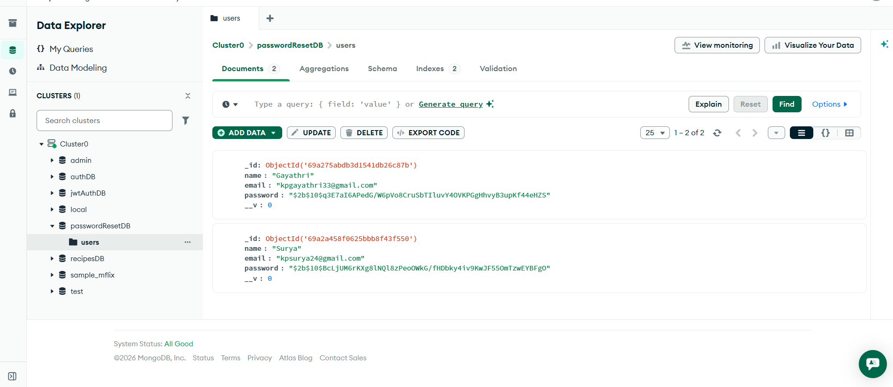

# Password Reset Flow

## About
- This secure Password Reset Flow is built using **React (Vite)**, **Node.js**, **Express**, and **MongoDB**. 
- This implements a complete and secure password reset flow as required. 
- It ensures proper user verification, token validation, secure password and storing in the database for webapp.

## Features
- User Registration
- Forgot Password via Email
- Secure Reset Token Generation
- Token Expiry (10 Minutes)
- Password Hashing using bcrypt
- Confirm Password Validation
- Loading States & Error Handling
- Responsive UI using Bootstrap
- Bootstrap Icons Integration

## Tech Stack

### Frontend
- React (Vite)
- Axios
- React Router
- Bootstrap
- Bootstrap Icons

### Backend
- Node.js
- Express.js
- MongoDB (Atlas) 
- MongoDB Compass
- Mongoose
- Nodemailer
- bcrypt
- crypto
- dotenv
- CORS

## How to use "Password Reset Flow"
1. New User registers using the Register page.
2. User clicks "Forgot Password".
3. System checks if email exists in database, random reset token is generated.
4. If email not exists in database, sends error message.
5. Token is stored in DB with 10-minute expiry.
6. Email is sent with reset link.
7. User clicks reset link.
8. Token is validated and expiry checked.
9. User sets new password.
10. Password is hashed and stored.
11. Reset token is cleared from DB.

## Screenshots
1. 

